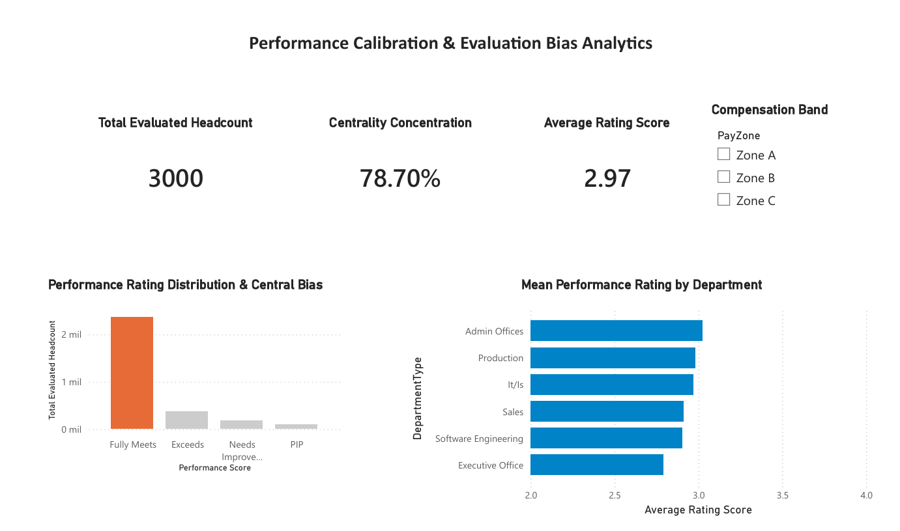

# 📊 Enterprise Workforce & Performance Calibration Framework

An end-to-end **Dual-Tier Analytics & HR Data Governance Framework** built to calibrate performance metrics, eliminate evaluation bias, and ensure headcount data integrity for **3,000+ enterprise employees**.

---

## 📌 Business Case & Problem Statement
In large-scale enterprise environments, performance calibration often suffers from **rater bias, inconsistent bell-curve distributions, and structural hierarchy disconnects** between operational HRIS platforms (SAP HCM/Workday) and payroll systems.

### Key Objectives Achieved:
1. **Automated Data Pipeline:** Replaced manual data cleansing with an automated **Power Query (M-Code)** ETL workflow.
2. **Dual-Tier Analytics Architecture:**
   * **Tier 1 (Executive View):** Excel-based demographic cockpit for high-level workforce structure and capacity analysis.
   * **Tier 2 (Analytical View):** Power BI dashboard measuring rating distribution curves, bias detection, and performance calibration metrics.
3. **Governance & Risk Mitigation:** Embedded **RACI Matrix** and **RAID Risk Logs** to prevent org-chart errors, payroll misalignment, and compliance breaches during review cycles.

---

## 🖼️ Dashboard Architecture & Visual Deliverables

### Tier 1: Executive Demographic Cockpit (Excel / Power Query)


### Tier 2: Performance Calibration & Bias Analytics (Power BI)


### Enterprise Data Governance Framework (RACI & RAID)
| RACI Governance Framework | RAID Risk Management Log |
| :---: | :---: |
|  |  |

---

## 🛠️ Architecture & Tech Stack
* **ETL & Data Transformation:** Power Query (M-Code)
* **Data Modeling & Analytics:** Power BI, DAX (Data Analysis Expressions)
* **Data Governance & Control:** RACI Matrix, RAID Log Framework, HR Lifecycle Controls
* **Systems Scope:** HRIS Governance (Workday / SAP SuccessFactors alignment)

---

## 📂 Repository Structure
```text
├── README.md                           <-- Main Project Documentation
├── src/
│   ├── ETL_PowerQuery_Queries.m        <-- Production M-Code ETL Script
│   └── dax_measures.dax                <-- Advanced DAX Calculations
├── docs/
│   ├── Performance_Workflow.md         <-- Interactive Mermaid Process Flow
│   ├── RACI_Governance_Matrix.md       <-- Markdown RACI Documentation
│   └── RAID_Risk_Management_Log.md     <-- Risk Mitigation Framework
├── Dashboards_PowerBI/                 <-- Source .pbix Files
├── Data/                               <-- Anonymized Datasets
└── Image/                              <-- High-Resolution Captures

👨‍💻 Author & Contact
Jesús Ángel Galicia Hernández

HR Digital Transformation, HRIS Governance & Workforce Analytics Specialist

📧 jesus.angel.galicia.90@gmail.com