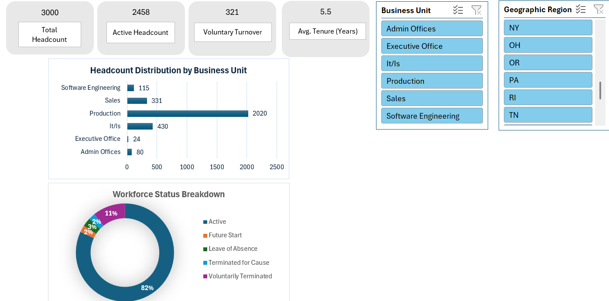

# 📊 Enterprise Workforce & Performance Calibration Framework

[](https://powerbi.microsoft.com/)
[](https://powerbi.microsoft.com/)
[](https://www.workday.com/)
[](#)

An end-to-end **Dual-Tier Analytics & HR Data Governance Framework** built to calibrate performance metrics, eliminate evaluation bias, and ensure headcount data integrity for **3,000+ enterprise employees**.

---

## 📌 Business Case & Executive Summary

In large-scale enterprise environments, performance calibration often suffers from **rater bias, central tendency concentration, and structural disconnects** between operational HRIS platforms (SAP HCM/Workday) and compensation systems.

### Key Deliverables & Achievements:
* **Automated Data Pipeline:** Replaced 12-hour manual data cleansing with an automated **Power Query (M-Code)** ETL workflow (**~95.8% time optimization**).
* **Dual-Tier Analytics Architecture:**
  * **Tier 1 (Executive View):** Excel-based demographic cockpit for workforce structure, turnover, and tenure analysis.
  * **Tier 2 (Analytical View):** Power BI dashboard detecting rating distribution skewness, central tendency bias (78.7%), and performance calibration metrics.
* **Governance & Risk Mitigation:** Embedded **RACI Matrix** and **RAID Risk Logs** to prevent org-chart errors, payroll misalignment, and compliance breaches during review cycles.

---

## 🖼️ Dashboard Architecture & Visual Deliverables

### Tier 1: Executive Demographic Cockpit (Excel / Power Query)


### Tier 2: Performance Calibration & Bias Analytics (Power BI)


---

## ⚙️ Core DAX Analytics Engine

Below are the key measures implemented within the dedicated `_Medidas` container table in Power BI to audit distribution bias and identify performance outliers:

```dax
// =========================================================================
// Author: Jesús Ángel Galicia Hernández
// Project: Enterprise Workforce Performance Calibration
// Description: Core DAX Measures for Calibration & Rating Distribution
// =========================================================================

// 1. Total Calibrated Headcount
Calibrated_Headcount = 
CALCULATE(
    COUNTROWS('Strategic_Workforce_Dataset'),
    'Strategic_Workforce_Dataset'[Employment_Status] = "Active"
)

// 2. High Performers Target Distribution (%)
High_Performers_Pct = 
VAR HighPerformers = 
    CALCULATE(
        [Calibrated_Headcount],
        'Strategic_Workforce_Dataset'[Performance_Rating] IN {"Exceeds Expectations", "Top Performer"}
    )
RETURN
DIVIDE(HighPerformers, [Calibrated_Headcount], 0)

// 3. Calibration Outlier Audit Flag (Governance Control)
Calibration_Bias_Risk_Flag = 
IF(
    [High_Performers_Pct] > 0.20,
    "HIGH RISK: Skewed Rating Distribution (>20%)",
    "GOVERNED: Normal Distribution Curve"
)

🛡️ Governance & Enterprise Risk ControlRACI Governance FrameworkRAID Risk Management Log

Enterprise-Workforce-Performance-Calibration/
│
├── README.md                           <-- Executive Project Documentation
│
├── src/                                <-- TECHNICAL CODE
│   ├── ETL_PowerQuery_Queries.m        <-- Production M-Code ETL Script
│   └── dax_measures.dax                <-- Core DAX Calculation Measures
│
├── docs/                               <-- GOVERNANCE & FRAMEWORKS
│   ├── Performance_Workflow.md         <-- Interactive Mermaid Process Flow
│   ├── RACI_Governance_Matrix.md       <-- Markdown RACI Documentation
│   ├── RAID_Risk_Management_Log.md     <-- Risk & Mitigation Framework
│   └── Case_Study_Executive_Summary_EN.pdf <-- Executive Strategy Paper
│
├── Data/                               <-- DATASETS
│   ├── Strategic_Workforce_Dataset.xlsx
│   └── DATASET RRHH.csv
│
├── Dashboards_PowerBI/                 <-- POWER BI SOURCE
│   └── Performance Calibration & Evaluation Bias Analytics.pbix
│
└── Image/                              <-- DASHBOARD CAPTURES & DIAGRAMS
    ├── Tier1_Excel_Demographics_Cockpit.png
    ├── Tier2_PowerBI_Calibration_Analytics.png
    ├── RACI Governance Matrix.png
    └── RAID Risk Managment Log.png

🛠️ Tech Stack & HRIS Ecosystem
ETL Engine: Power Query (Language M)

Analytics & Visualization: Power BI Desktop, Advanced DAX, Microsoft Excel

HR Data Governance: RACI Framework, RAID Risk Logging

Target Enterprise Systems: Workday HCM, SAP SuccessFactors, SICH+

👨‍💻 Author & Contact
Jesús Ángel Galicia Hernández

HR Digital Transformation, HRIS Governance & People Analytics Specialist

📧 jesus.angel.galicia.90@gmail.com
